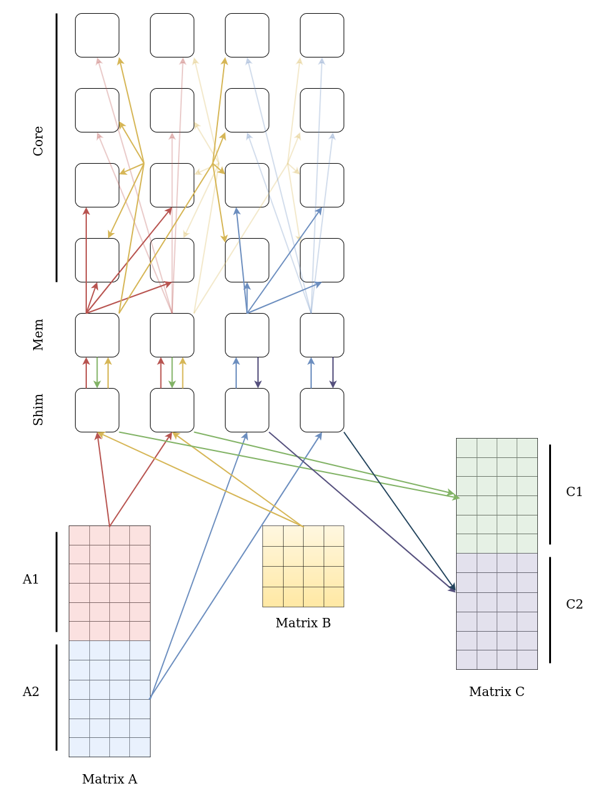

<!---//===- README.md -----------------------------------------*- Markdown -*-===//
//
// This file is licensed under the Apache License v2.0 with LLVM Exceptions.
// See https://llvm.org/LICENSE.txt for license information.
// SPDX-License-Identifier: Apache-2.0 WITH LLVM-exception
//
// Copyright (C) 2024, Advanced Micro Devices, Inc.
//
//===----------------------------------------------------------------------===//-->

# Matrix Multiplication - Small-Dimension Design
This design is inspired by the whole-array approach but is better suited for thin matrix (Matrix A) multiplication. The concept involves splitting the input matrix A into two submatrices of equal size and performing matrix multiplication for each submatrix using two columns of the AI Engine (AIE).

## Data movement inside NPU

1. Matrix A: The input matrix AA is divided into two submatrices: A1 (upper part) and A2 (lower part). Each submatrix is streamed to two memory tiles in the NPU and subsequently directed to two core tiles in each row of the NPU.
2. Matrix B: The input matrix BB is streamed across the columns of the NPU. Unlike the whole-array design, each submatrix of B is streamed to two columns of the NPU to enable multiplication with both A1 and A2.
3. Output matrix C: The output matrix C is composed of two submatrices: C1 (upper part) and C2 (lower part). These correspond to the results of the matrix multiplications A1×B and A2×B, respectively. The submatrices C1 and C2 are then streamed to external memory to complete the matrix multiplication operation.
[]

